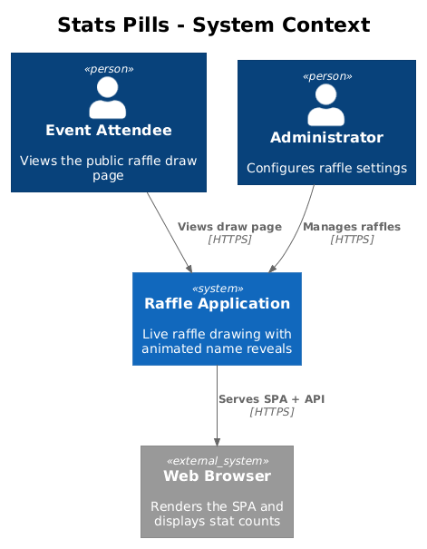
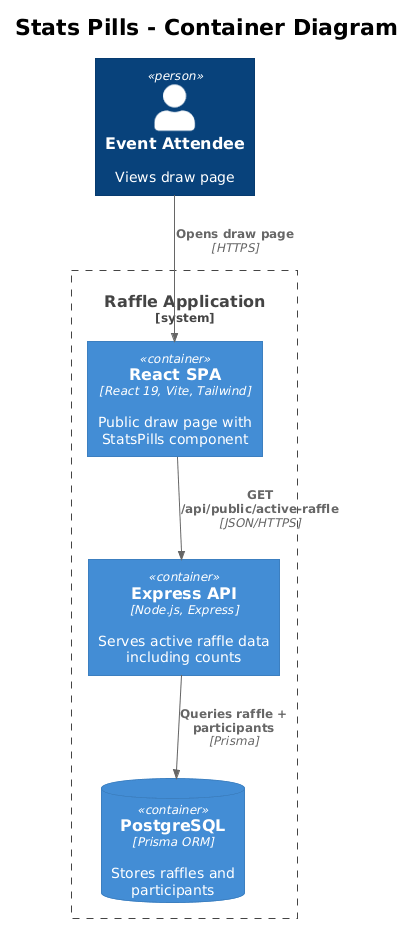
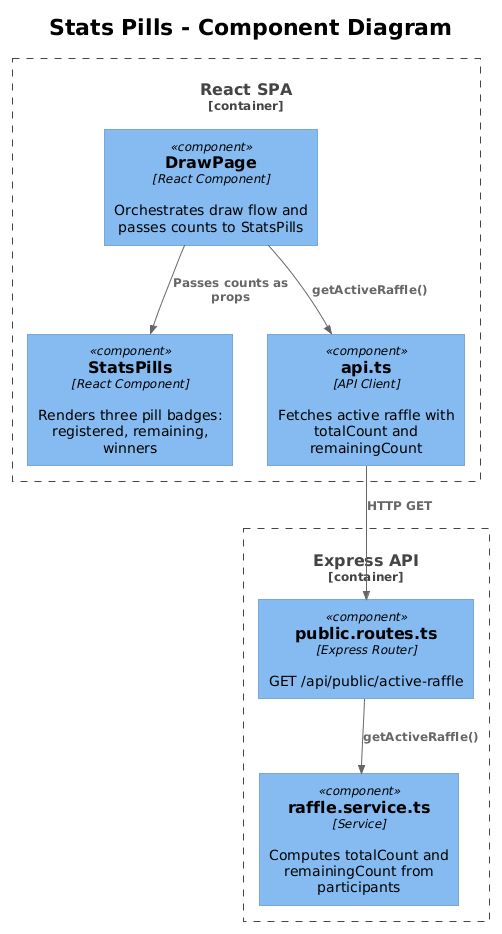
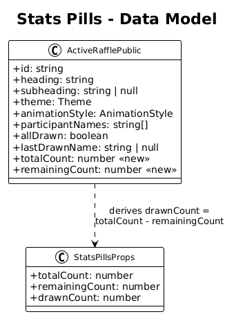
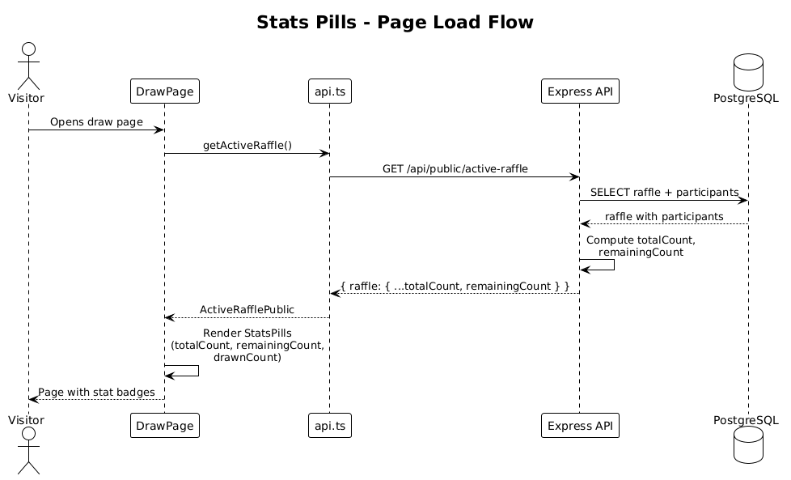

# Stats Pills — Detailed Design

## 1. Overview

Add a row of pill-shaped stat badges to the public draw page that show **total registered**, **remaining**, and **winners drawn** counts in real time. During live events, audiences currently have no visibility into how many names are left or how many have been drawn. This feature provides instant context at a glance — especially valuable on large screens and projectors.

**Actors:** Public visitors viewing the draw page.

**Scope:** Client-side `DrawPage` component, `ActiveRafflePublic` API response shape, and the server-side `getActiveRaffle` service method.

**Traces to:** L1-001 (Public Raffle Drawing), L1-011 (Draw Animation and Visual Experience).

**Note on L2-001:** The current acceptance criteria for L2-001 state *"No draw history, remaining count, or other ancillary information is displayed on the public page."* This design intentionally relaxes that constraint based on user feedback from live event usage. The L2 spec should be updated to permit optional stat display. This is called out here so reviewers can approve the spec change alongside the implementation.

## 2. Architecture

### 2.1 C4 Context Diagram



### 2.2 C4 Container Diagram



### 2.3 C4 Component Diagram



## 3. Component Details

### 3.1 `ActiveRafflePublic` Type Extension (shared)

**File:** `packages/shared/src/types/index.ts`

Add two new fields to the `ActiveRafflePublic` interface:

```typescript
export interface ActiveRafflePublic {
  // ... existing fields ...
  totalCount: number;      // total participants in the raffle
  remainingCount: number;  // participants not yet drawn
}
```

These are derived server-side from the participants list. `drawnCount` is computable as `totalCount - remainingCount`, so it is not transmitted.

### 3.2 `getActiveRaffle` Service Update (server)

**File:** `packages/server/src/services/raffle.service.ts`

The `getActiveRaffle()` function already queries all participants. Add two computed fields to the return object:

```typescript
return {
  // ... existing fields ...
  totalCount: raffle.participants.length,
  remainingCount: raffle.participants.filter(p => !p.isDrawn).length,
};
```

No additional database queries are needed — the data is already in memory.

### 3.3 `StatsPills` Component (client)

**File:** `packages/client/src/public-app/components/StatsPills.tsx`

A new presentational component that renders three pill-shaped badges.

**Props:**

```typescript
interface StatsPillsProps {
  totalCount: number;
  remainingCount: number;
  drawnCount: number;
}
```

**Rendering:**

Three inline pill badges in a horizontal flex row with gap-3, each styled as:
- Background: `var(--bg-secondary)` with `var(--border)` border
- Border radius: full (`rounded-full`)
- Padding: `px-4 py-1.5`
- Font: `font-geist text-sm`
- Color: `var(--fg-secondary)`

Each pill displays an emoji prefix and label:
- `👥 {totalCount} registered`
- `🎯 {remainingCount} remaining`
- `🏆 {drawnCount} winners`

The `drawnCount` pill updates after each draw via the refreshed raffle state.

**Accessibility:**
- Each pill has `role="status"` and `aria-live="polite"` so screen readers announce count changes.
- Emoji is wrapped in `<span aria-hidden="true">` to prevent screen readers from reading emoji names.
- A visually hidden `<span className="sr-only">` provides the text equivalent.

### 3.4 `DrawPage` Integration

**File:** `packages/client/src/public-app/pages/DrawPage.tsx`

Insert `<StatsPills>` between the subheading and the name display area. The component receives counts derived from the `raffle` state object:

```tsx
<StatsPills
  totalCount={raffle.totalCount}
  remainingCount={raffle.remainingCount}
  drawnCount={raffle.totalCount - raffle.remainingCount}
/>
```

After each draw completes (in the `handleAnimationComplete` callback), the raffle state is already refreshed via `getActiveRaffle()`, so the pills update automatically.

## 4. Data Model

### 4.1 Class Diagram



### 4.2 Entity Descriptions

No database schema changes. The `totalCount` and `remainingCount` fields are computed at query time from the existing `Participant` table's `isDrawn` column.

## 5. Key Workflows

### 5.1 Page Load — Stats Display



1. User opens the public draw page.
2. `DrawPage` calls `getActiveRaffle()` API.
3. Server queries raffle + participants, computes counts.
4. Response includes `totalCount` and `remainingCount`.
5. `DrawPage` renders `StatsPills` with the counts.

### 5.2 Post-Draw — Stats Refresh

1. User clicks "Draw a Name."
2. Animation plays and completes.
3. `handleAnimationComplete` calls `getActiveRaffle()` to refresh state.
4. `StatsPills` re-renders with updated `remainingCount` (decremented by 1) and `drawnCount` (incremented by 1).

## 6. API Contracts

**Endpoint:** `GET /api/public/active-raffle`

**Response shape change (additive):**

```json
{
  "raffle": {
    "id": "...",
    "heading": "...",
    "subheading": "...",
    "theme": "cosmic",
    "animationStyle": "slot_machine",
    "participantNames": ["Alice", "Bob", "Charlie"],
    "allDrawn": false,
    "lastDrawnName": null,
    "totalCount": 50,
    "remainingCount": 48
  }
}
```

This is a backward-compatible additive change.

## 7. Security Considerations

- `totalCount` and `remainingCount` are aggregate counts, not PII. No participant names are leaked beyond what `participantNames` already exposes.
- No new endpoints or authentication changes.

## 8. Open Questions

1. **Should the pills be hidden on xs screens to keep the draw page minimal?** The pills add a row of content. On very small phones they may push the draw button below the fold. Consider hiding on `xs` breakpoint (`hidden sm:flex`).
2. **L2-001 spec update:** The current spec explicitly prohibits ancillary info on the public page. A spec amendment is needed before implementation. Reviewers should confirm this is acceptable.
