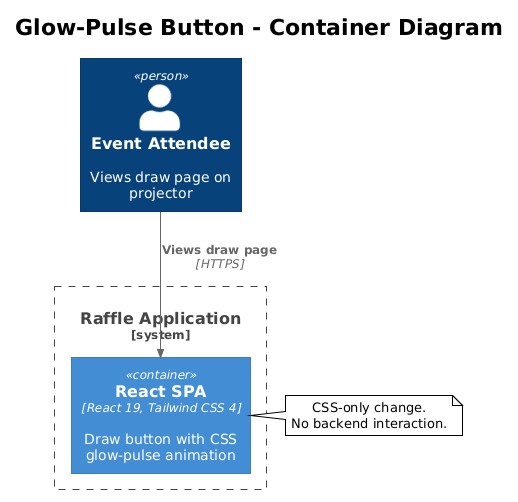
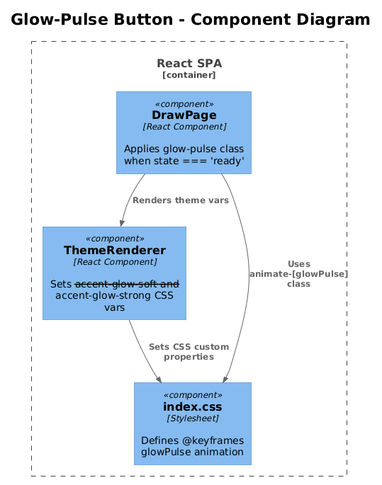

# Glow-Pulse Draw Button — Detailed Design

## 1. Overview

Add a continuous glow-pulse animation to the "Draw a Name" button when it is in the `ready` state (idle, awaiting a click). On a projector screen during a live event, no one is hovering over the button — the current hover-only glow enhancement is invisible. A subtle pulsing glow draws the audience's eye to the call-to-action without requiring mouse interaction.

Inspired by octo-spin's `glowPulse` keyframe animation, but adapted to use the Raffle project's theme-aware CSS variables.

**Actors:** Public visitors viewing the draw page (primarily on large projected screens).

**Scope:** CSS animation added to `DrawPage.tsx` button styles. No backend changes.

**Traces to:** L1-011 (Draw Animation and Visual Experience), L1-008 (Accessibility).

## 2. Architecture

### 2.1 C4 Context Diagram

Not applicable — this is a CSS-only change within the SPA container.

### 2.2 C4 Container Diagram



### 2.3 C4 Component Diagram



## 3. Component Details

### 3.1 CSS Keyframe Definition

**File:** `packages/client/src/index.css`

Add a new `@keyframes glowPulse` rule inside the existing `@layer base`:

```css
@keyframes glowPulse {
  0%, 100% {
    box-shadow: 0 4px 24px var(--accent-glow-soft);
  }
  50% {
    box-shadow: 0 6px 40px var(--accent-glow-strong),
                0 0 60px var(--accent-glow-soft);
  }
}
```

Where `--accent-glow-soft` and `--accent-glow-strong` are new CSS variables added to each theme definition in `ThemeRenderer.tsx`:

| Theme | `--accent-glow-soft` | `--accent-glow-strong` |
|-------|---------------------|----------------------|
| cosmic | `rgba(168, 85, 247, 0.35)` | `rgba(168, 85, 247, 0.7)` |
| festive | `rgba(239, 68, 68, 0.35)` | `rgba(239, 68, 68, 0.7)` |
| corporate | `rgba(59, 130, 246, 0.35)` | `rgba(59, 130, 246, 0.7)` |

### 3.2 `DrawPage.tsx` Button Modification

**File:** `packages/client/src/public-app/pages/DrawPage.tsx`

Add the `animate-glow-pulse` utility class to the draw button **only** when `state === 'ready'`:

```tsx
className={`
  font-anton uppercase ...existing classes...
  ${state === 'ready' ? 'animate-[glowPulse_2.5s_ease-in-out_infinite]' : ''}
`}
```

The animation is removed during `cycling`, `winner-revealed`, `all-drawn`, and `disabled` states by the conditional. The existing `shadow-[0_4px_24px_...]` static shadow should be kept as a fallback for when the animation is not active.

### 3.3 Accessibility — Reduced Motion

**File:** `packages/client/src/index.css`

The glow-pulse animation must respect `prefers-reduced-motion`:

```css
@media (prefers-reduced-motion: reduce) {
  .animate-\\[glowPulse_2\\.5s_ease-in-out_infinite\\] {
    animation: none !important;
  }
}
```

Alternatively, use Tailwind's `motion-safe:` prefix:

```tsx
className={`
  ...
  ${state === 'ready' ? 'motion-safe:animate-[glowPulse_2.5s_ease-in-out_infinite]' : ''}
`}
```

This is the preferred approach — it's declarative and requires no extra CSS rule.

### 3.4 Theme Variable Updates

**File:** `packages/client/src/public-app/themes/ThemeRenderer.tsx`

Add `--accent-glow-soft` and `--accent-glow-strong` to each theme definition object in `themeDefinitions`.

## 4. Data Model

No data model changes.

## 5. Key Workflows

### 5.1 Button State Lifecycle

The glow-pulse animation is active only during the `ready` state. The full lifecycle:

1. **`loading`** — Button not rendered.
2. **`no-active-raffle`** — Button not rendered.
3. **`ready`** — Button visible, glow-pulse animation running (2.5s cycle, infinite).
4. **`cycling`** — Button disabled, animation removed, static disabled styling.
5. **`winner-revealed`** — Button disabled, static styling.
6. **`all-drawn`** — Button disabled, static styling.

No sequence diagram needed — this is purely a CSS state toggle.

## 6. API Contracts

No API changes.

## 7. Security Considerations

None — CSS-only change.

## 8. Open Questions

1. **Animation duration:** 2.5s is slightly slower than octo-spin's 2s. This feels less frenetic on a large screen. Should it be configurable per theme, or is a fixed duration fine?
2. **Should the glow-pulse be theme-configurable from the admin?** Currently hard-coded. Adding it to the theme definition gives administrators control, but increases config complexity for minimal gain.
