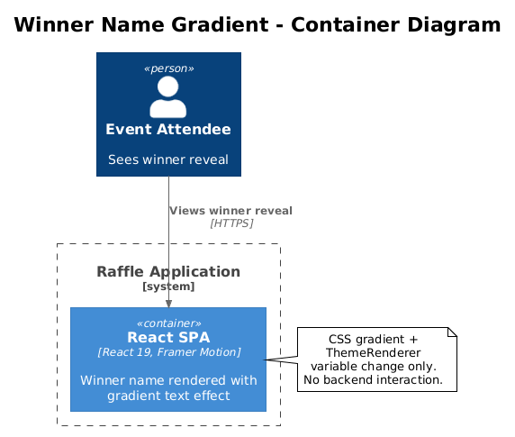
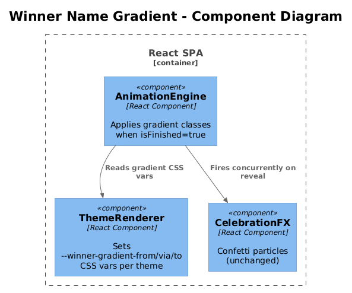

# Winner Name Gradient — Detailed Design

## 1. Overview

When the draw animation lands on the winner, the revealed name currently displays in the theme's solid accent color (`var(--accent)`). This design replaces the solid color with a vibrant multi-color gradient that is visually distinct from the rest of the UI, making the winner reveal moment feel more celebratory and special.

Inspired by octo-spin's `bg-gradient-to-r from-[#f59e0b] via-[#ec4899] to-[#8b5cf6]` winner display, but adapted to be theme-aware.

**Actors:** Public visitors viewing the draw page.

**Scope:** `AnimationEngine.tsx` styling for the `isFinished` state. CSS variable additions to `ThemeRenderer.tsx`. No backend changes.

**Traces to:** L1-011 (Draw Animation and Visual Experience), L2-032 (Celebratory Winner Reveal).

## 2. Architecture

### 2.1 C4 Context Diagram

Not applicable — purely a frontend styling change.

### 2.2 C4 Container Diagram



### 2.3 C4 Component Diagram



## 3. Component Details

### 3.1 Theme Gradient Variables

**File:** `packages/client/src/public-app/themes/ThemeRenderer.tsx`

Add three new CSS variables per theme for the winner gradient stops:

| Theme | `--winner-gradient-from` | `--winner-gradient-via` | `--winner-gradient-to` |
|-------|------------------------|------------------------|----------------------|
| cosmic | `#F59E0B` (amber) | `#EC4899` (pink) | `#8B5CF6` (purple) |
| festive | `#FCD34D` (gold) | `#FB923C` (orange) | `#EF4444` (red) |
| corporate | `#60A5FA` (light blue) | `#A78BFA` (lavender) | `#34D399` (emerald) |

Each gradient is designed to:
- Contrast strongly against the dark background of the name display area.
- Feel celebratory and distinct from the theme's primary accent color.
- Maintain WCAG AA contrast (4.5:1 minimum) against the `#1C1A20` / `#151318` radial gradient background of the slot display.

### 3.2 `AnimationEngine.tsx` — Winner Text Styling

**File:** `packages/client/src/public-app/animations/AnimationEngine.tsx`

Replace the solid accent color with a gradient text effect when `isFinished` is true:

**Current (line 147):**
```tsx
${isFinished ? 'text-[var(--accent)]' : 'text-[var(--fg-primary)]'}
```

**Proposed:**
```tsx
${isFinished
  ? 'bg-gradient-to-r from-[var(--winner-gradient-from)] via-[var(--winner-gradient-via)] to-[var(--winner-gradient-to)] bg-clip-text text-transparent'
  : 'text-[var(--fg-primary)]'}
```

The `bg-clip-text text-transparent` technique clips the gradient to the text shape. This is well-supported in all modern browsers.

### 3.3 Winner Reveal Animation Enhancement

Optionally, add a subtle shimmer/shift animation to the gradient to make it feel alive during the celebration window:

```css
@keyframes gradientShift {
  0%   { background-position: 0% 50%; }
  50%  { background-position: 100% 50%; }
  100% { background-position: 0% 50%; }
}
```

Applied with `background-size: 200% auto` and `animate-[gradientShift_3s_ease_infinite]` on the winner text. This is optional and should respect `prefers-reduced-motion`.

### 3.4 Accessibility

- **Contrast:** All gradient color stops have been chosen to meet WCAG AA 4.5:1 against the slot display background (#1C1A20). Amber (#F59E0B) = 8.2:1, Pink (#EC4899) = 5.9:1, Purple (#8B5CF6) = 4.6:1.
- **Reduced motion:** The optional shimmer animation uses `motion-safe:` prefix.
- **Screen readers:** Unaffected — the text content is the same, only the visual color changes. The ARIA live region still announces the winner name.

## 4. Data Model

No data model changes.

## 5. Key Workflows

### 5.1 Winner Reveal Styling Flow

1. `AnimationEngine` cycles through names with `text-[var(--fg-primary)]` (white).
2. Timer reaches 100% — `isFinished` becomes `true`.
3. `currentName` is set to the winner's name.
4. Framer Motion `key` changes, triggering an enter animation.
5. The gradient classes apply, rendering the winner name with the theme's celebratory gradient.
6. `CelebrationFX` confetti fires simultaneously.

## 6. API Contracts

No API changes.

## 7. Security Considerations

None — CSS-only change.

## 8. Open Questions

1. **Should the gradient be configurable per raffle from the admin panel?** This adds complexity (3 new fields per raffle). Recommendation: keep it theme-level for now. Administrators choose the theme; the winner gradient comes with it.
2. **Should the shimmer animation be included in v1?** It adds visual polish but also adds a keyframe and more motion. Could be deferred to a follow-up if the static gradient is sufficient.
