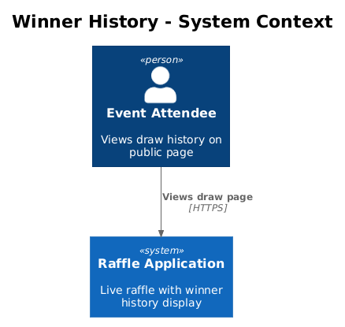
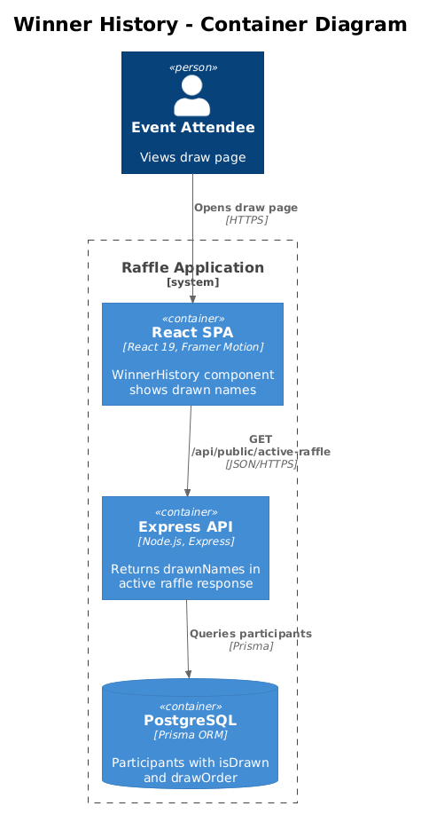
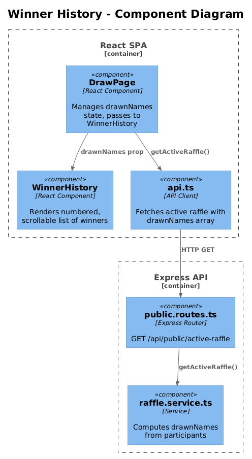
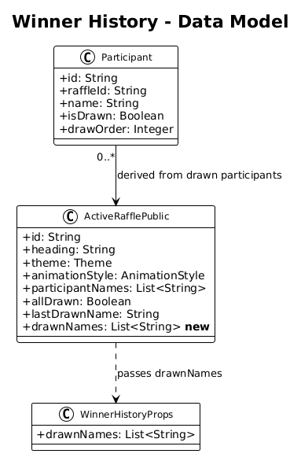
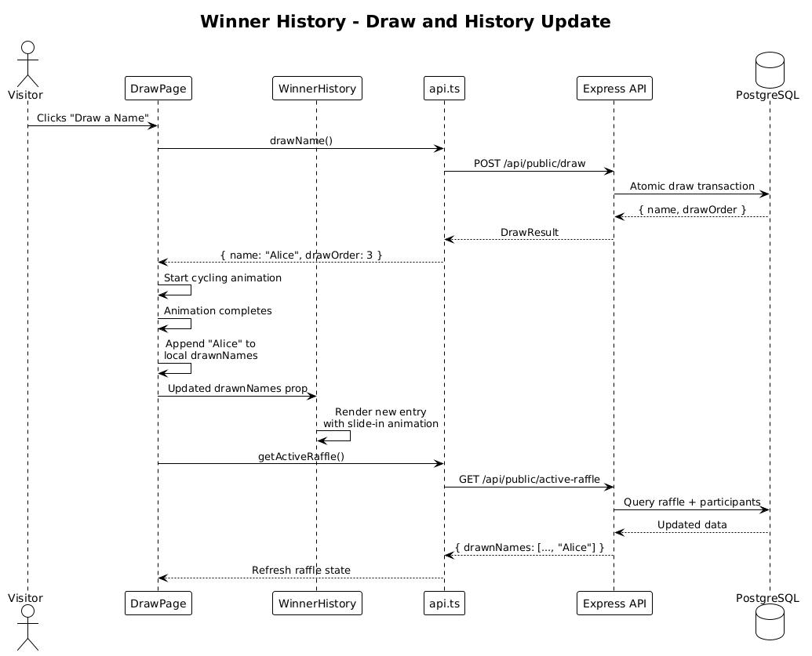

# Winner History List — Detailed Design

## 1. Overview

Add a numbered, scrollable list of previously drawn winners directly on the public draw page, displayed below the draw button. During live events, audiences enjoy seeing the running list of winners as it grows — it maintains energy and gives context to how many draws have occurred. Currently, draw history is only visible in the admin back office.

Inspired by octo-spin's reverse-chronological winner list with `#N` numbering, GitHub handle, and company.

**Actors:** Public visitors viewing the draw page.

**Scope:** New `WinnerHistory` client component, expansion of `ActiveRafflePublic` API response, server-side `getActiveRaffle` update.

**Traces to:** L1-001 (Public Raffle Drawing), L1-011 (Draw Animation and Visual Experience).

**Note on L2-001:** As with the Stats Pills feature (01), the current L2-001 spec prohibits ancillary information on the public page. This design requires a spec amendment.

## 2. Architecture

### 2.1 C4 Context Diagram



### 2.2 C4 Container Diagram



### 2.3 C4 Component Diagram



## 3. Component Details

### 3.1 `ActiveRafflePublic` Type Extension (shared)

**File:** `packages/shared/src/types/index.ts`

Add a `drawnNames` array to the `ActiveRafflePublic` interface:

```typescript
export interface ActiveRafflePublic {
  // ... existing fields ...
  drawnNames: string[];  // names drawn so far, ordered by draw order (earliest first)
}
```

This provides the ordered history of drawn names. The array is empty before any draws.

### 3.2 `getActiveRaffle` Service Update (server)

**File:** `packages/server/src/services/raffle.service.ts`

The function already queries all participants with `isDrawn` and `drawOrder`. Add a computed field:

```typescript
const drawnParticipants = raffle.participants
  .filter(p => p.isDrawn && p.drawOrder !== null)
  .sort((a, b) => (a.drawOrder ?? 0) - (b.drawOrder ?? 0));

return {
  // ... existing fields ...
  drawnNames: drawnParticipants.map(p => p.name),
};
```

### 3.3 `WinnerHistory` Component (client)

**File:** `packages/client/src/public-app/components/WinnerHistory.tsx`

A presentational component that renders the drawn-names list.

**Props:**

```typescript
interface WinnerHistoryProps {
  drawnNames: string[];
}
```

**Rendering:**

- Only renders when `drawnNames.length > 0`.
- Full-width container, max-width `500px` (matching the slot display).
- Header: "Winners ({count})" with a trophy icon, styled with `font-geist text-base text-[var(--fg-secondary)]`.
- List: Reverse-ordered (most recent first). Each item is a card row:
  - Left side: `#{drawOrder}` number badge in `text-[var(--fg-muted)]`, then the winner name in `font-bold text-[var(--fg-primary)]`.
  - Background: `var(--bg-secondary)` with `var(--border)` border.
  - Border radius: `rounded-xl`.
  - Padding: `px-4 py-3`.
  - Gap between items: `gap-2`.
- **Max height & scroll:** If more than 5 items, the list is capped at `max-h-[280px]` with `overflow-y-auto` and a subtle fade gradient at the bottom using a CSS mask.

**Animations:**
- New entries slide in from the left with a Framer Motion `initial={{ x: -20, opacity: 0 }}` → `animate={{ x: 0, opacity: 1 }}` transition.
- Respects `prefers-reduced-motion` (instant render, no slide).

**Accessibility:**
- The list uses `<ol>` (ordered list) semantics.
- The header uses `<h2>` for proper document outline.
- `aria-live="polite"` on the list container so screen readers announce new winners.

### 3.4 `DrawPage` Integration

**File:** `packages/client/src/public-app/pages/DrawPage.tsx`

Insert `<WinnerHistory>` below the draw button. Track local drawn names from both the API response and newly drawn names:

```tsx
const [drawnNames, setDrawnNames] = useState<string[]>([]);

// On initial load, populate from API
useEffect(() => {
  if (raffle?.drawnNames) {
    setDrawnNames(raffle.drawnNames);
  }
}, [raffle?.drawnNames]);

// After animation complete, append the new winner immediately
// (before the API refresh, for instant feedback)
const handleAnimationComplete = useCallback(() => {
  setDrawnNames(prev => [...prev, winnerName]);
  // ... existing logic (audio, celebration, API refresh) ...
}, [winnerName]);
```

This gives instant UI feedback — the winner appears in the list as soon as the animation completes, without waiting for the API refresh.

## 4. Data Model

### 4.1 Class Diagram



### 4.2 Entity Descriptions

No schema changes. `drawnNames` is derived from the existing `Participant` table's `isDrawn` and `drawOrder` columns.

## 5. Key Workflows

### 5.1 Draw and History Update



1. User clicks "Draw a Name."
2. Client calls `POST /api/public/draw` — server returns `{ name, drawOrder }`.
3. Client starts animation (cycling state).
4. Animation completes — `handleAnimationComplete` fires.
5. Winner name is appended to local `drawnNames` state (instant UI update).
6. Client calls `GET /api/public/active-raffle` to refresh full state.
7. `WinnerHistory` re-renders with the updated list.

## 6. API Contracts

**Endpoint:** `GET /api/public/active-raffle`

**Response shape change (additive):**

```json
{
  "raffle": {
    "id": "...",
    "heading": "...",
    "participantNames": ["Alice", "Bob"],
    "allDrawn": false,
    "lastDrawnName": "Charlie",
    "drawnNames": ["Charlie", "Dave", "Eve"]
  }
}
```

`drawnNames` is ordered by `drawOrder` ascending (earliest draw first).

## 7. Security Considerations

- `drawnNames` contains participant names that are already present in `participantNames`. No new data exposure.
- The draw order is implicit in array position — no sensitive metadata is leaked.

## 8. Open Questions

1. **Should the winner history be collapsible?** On small screens, the list could push page content down significantly. Consider a toggle button or accordion pattern on `xs`/`sm` breakpoints.
2. **Should the list show draw order times?** octo-spin doesn't show timestamps, and neither does this design. Adding "drawn at 2:34 PM" could be useful for formal events but adds clutter. Deferred.
3. **Performance with large raffles:** For raffles with 500+ participants, the `drawnNames` array in the API response could grow large. This is acceptable for typical event sizes (10-200 participants). For extreme cases, consider pagination.
