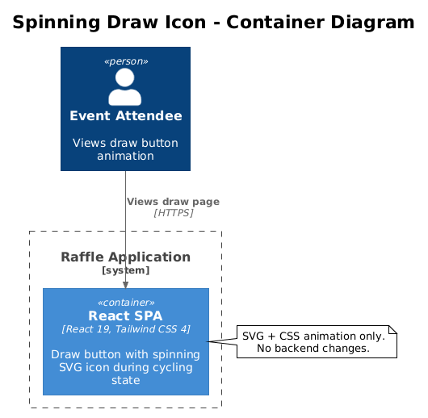
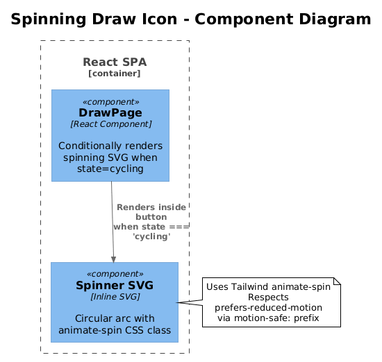

# Spinning Draw Icon — Detailed Design

## 1. Overview

During the draw animation, the "Draw a Name" button changes its text to "Drawing..." but has no visual motion indicator. Adding a spinning icon beside the text provides immediate visual feedback that something is happening — especially important on projectors where the button is large and visible, and the audience can't see the name cycling animation from a distance.

Inspired by octo-spin's spinning GitHub logo inside the draw button during the cycling state.

**Actors:** Public visitors viewing the draw page.

**Scope:** `DrawPage.tsx` button content. CSS spin animation. No backend changes.

**Traces to:** L1-011 (Draw Animation and Visual Experience).

## 2. Architecture

### 2.1 C4 Context Diagram

Not applicable — purely a frontend UI change.

### 2.2 C4 Container Diagram



### 2.3 C4 Component Diagram



## 3. Component Details

### 3.1 Spin Animation CSS

**File:** `packages/client/src/index.css`

Add a CSS spin keyframe (if not already present via Tailwind's `animate-spin`):

```css
@keyframes spin {
  from { transform: rotate(0deg); }
  to { transform: rotate(360deg); }
}
```

Tailwind CSS 4 includes `animate-spin` out of the box, so the existing utility class can be used: `animate-spin`.

### 3.2 Icon Selection

Use a simple SVG loader icon (circular arc) rather than a branded logo. The raffle app is not GitHub-branded, so using the GitHub Invertocat (as octo-spin does) would be inappropriate. A ticket/raffle-ticket icon or a generic circular loader is the right choice.

**Recommended icon:** A circular arc (the same style used by Tailwind's default `animate-spin` examples):

```tsx
<svg className="w-5 h-5 sm:w-6 sm:h-6 animate-spin" viewBox="0 0 24 24" fill="none">
  <circle cx="12" cy="12" r="10" stroke="currentColor" strokeWidth="3" strokeLinecap="round" strokeDasharray="32" strokeDashoffset="8" />
</svg>
```

This renders as a partial circle that spins — universally recognized as a loading indicator.

### 3.3 `DrawPage.tsx` Button Content Update

**File:** `packages/client/src/public-app/pages/DrawPage.tsx`

Update the button's content rendering (lines 271-278):

**Current:**
```tsx
{state === 'all-drawn'
  ? 'All Names Drawn'
  : state === 'cycling'
    ? 'Drawing...'
    : state === 'winner-revealed'
      ? 'Revealing...'
      : 'Draw a Name'}
```

**Proposed:**
```tsx
{state === 'all-drawn' ? (
  'All Names Drawn'
) : state === 'cycling' ? (
  <span className="inline-flex items-center gap-3">
    <svg
      className="w-5 h-5 sm:w-6 sm:h-6 motion-safe:animate-spin"
      viewBox="0 0 24 24"
      fill="none"
      aria-hidden="true"
    >
      <circle
        cx="12" cy="12" r="10"
        stroke="currentColor" strokeWidth="3"
        strokeLinecap="round"
        strokeDasharray="32" strokeDashoffset="8"
      />
    </svg>
    Drawing...
  </span>
) : state === 'winner-revealed' ? (
  'Revealing...'
) : (
  'Draw a Name'
)}
```

**Key details:**
- The icon uses `motion-safe:animate-spin` — it won't spin for users with `prefers-reduced-motion` enabled.
- `aria-hidden="true"` prevents screen readers from describing the SVG; the "Drawing..." text is sufficient.
- The icon is sized proportionally to the button text (`w-5 h-5` on mobile, `w-6 h-6` on `sm+`).
- `inline-flex items-center gap-3` keeps the icon and text horizontally aligned with consistent spacing.

## 4. Data Model

No data model changes.

## 5. Key Workflows

### 5.1 Button Content State Machine

| State | Button Content | Icon |
|-------|---------------|------|
| `loading` | Not rendered | — |
| `no-active-raffle` | Not rendered | — |
| `ready` | "Draw a Name" | None |
| `cycling` | "Drawing..." | Spinning circle (animate-spin) |
| `winner-revealed` | "Revealing..." | None |
| `all-drawn` | "All Names Drawn" | None |

## 6. API Contracts

No API changes.

## 7. Security Considerations

None — SVG icon and CSS animation only.

## 8. Open Questions

1. **Should the `winner-revealed` state also have an icon?** A checkmark or sparkle icon could reinforce the reveal. Keeping it text-only for now to avoid visual clutter — the celebration effects already provide feedback.
2. **Icon color:** Uses `currentColor` which inherits from the button text color (`text-white` when active, `text-[var(--fg-muted)]` when disabled). This is correct behavior — no explicit color needed.
