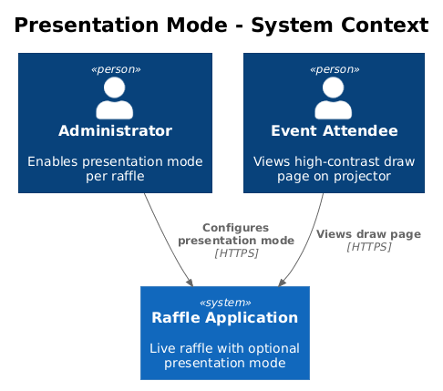
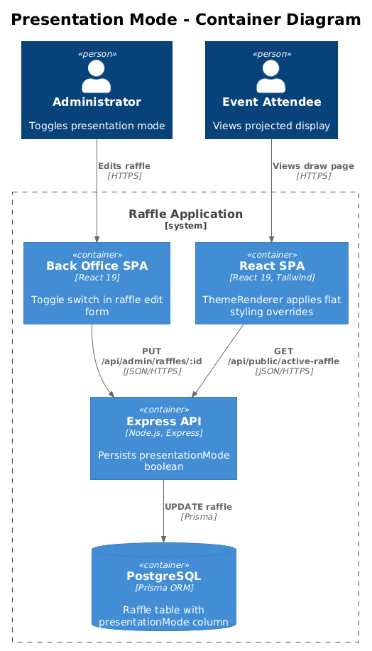
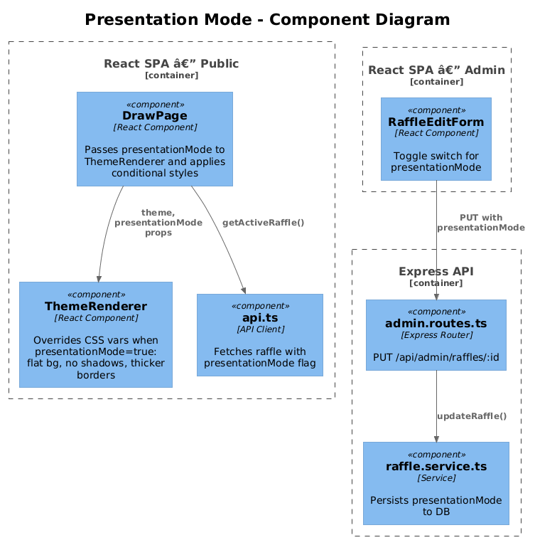
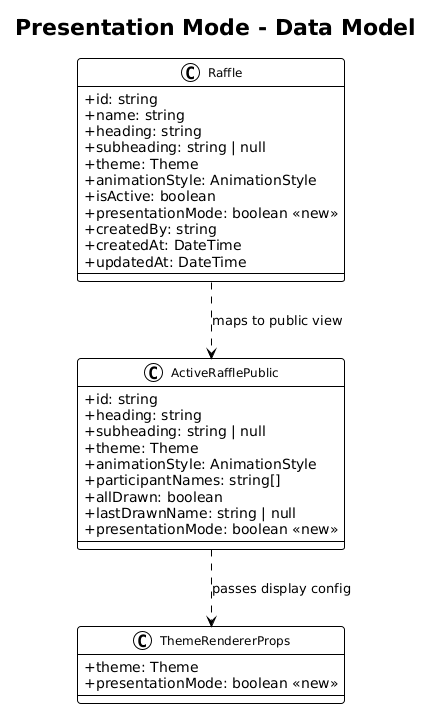
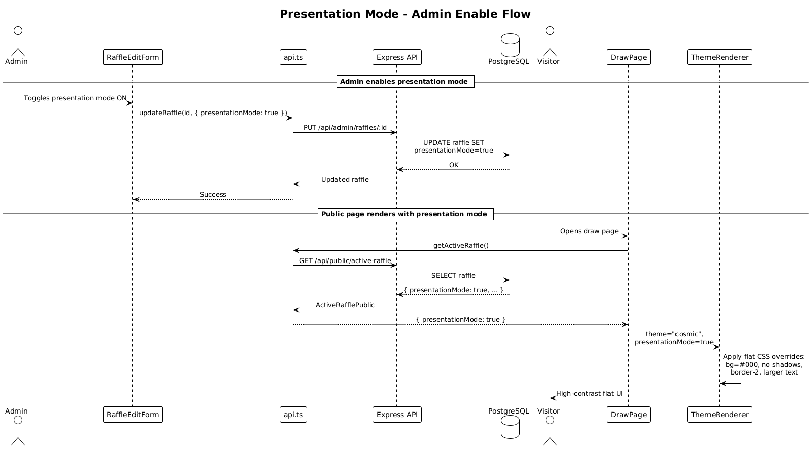

# Presentation Mode — Detailed Design

## 1. Overview

The current draw page uses complex multi-layer shadows, radial gradients, and subtle border opacities that look excellent on a high-resolution monitor but can appear muddy or washed out on projectors (typically 1080p, low contrast, bright rooms). This feature adds an optional "presentation mode" that switches the draw page to a flatter, higher-contrast visual style optimized for projected displays.

**Actors:** Event organizers (admin) who configure presentation mode per raffle; public visitors who see the result.

**Scope:** New `presentationMode` boolean on the Raffle model, admin form update, `ThemeRenderer` modifications, `DrawPage` conditional styling. Backend schema change required.

**Traces to:** L1-003 (Back Office Administration), L1-011 (Draw Animation and Visual Experience), L2-035 (Theme Selection).

## 2. Architecture

### 2.1 C4 Context Diagram



### 2.2 C4 Container Diagram



### 2.3 C4 Component Diagram



## 3. Component Details

### 3.1 Database Schema Change

**File:** `packages/server/prisma/schema.prisma`

Add a `presentationMode` boolean column to the `Raffle` model:

```prisma
model Raffle {
  // ... existing fields ...
  presentationMode Boolean @default(false)
}
```

**Migration:** `npx prisma migrate dev --name add_presentation_mode`

Default is `false` — existing raffles are unaffected.

### 3.2 Shared Types Update

**File:** `packages/shared/src/types/index.ts`

Add `presentationMode` to the relevant interfaces:

```typescript
export interface Raffle {
  // ... existing fields ...
  presentationMode: boolean;
}

export interface ActiveRafflePublic {
  // ... existing fields ...
  presentationMode: boolean;
}

export interface CreateRaffleInput {
  // ... existing fields ...
  presentationMode?: boolean;
}

export interface UpdateRaffleInput {
  // ... existing fields ...
  presentationMode?: boolean;
}
```

### 3.3 Server-Side Updates

**File:** `packages/server/src/services/raffle.service.ts`

- `getActiveRaffle()`: Include `presentationMode` in the return object (it's already queried from the Raffle table).
- `createRaffle()` / `updateRaffle()`: Accept and persist the `presentationMode` field.

**File:** `packages/server/src/routes/public.routes.ts`

No changes — the existing route serializes the full `ActiveRafflePublic` object.

### 3.4 Presentation Mode CSS Variables

**File:** `packages/client/src/public-app/themes/ThemeRenderer.tsx`

When `presentationMode` is true, override specific CSS variables to flatten the visual style. This is implemented by accepting a `presentationMode` prop:

```typescript
interface ThemeRendererProps {
  theme: Theme;
  presentationMode?: boolean;
}
```

When `presentationMode` is true, apply these overrides after the theme variables:

| Variable | Normal | Presentation Mode |
|----------|--------|-------------------|
| `--bg-primary` | Theme default (e.g., `#0A0A0A`) | `#000000` (pure black — maximum contrast) |
| `--fg-primary` | `#FFFFFF` | `#FFFFFF` (unchanged) |
| `--presentation-shadow` | `none` | Applied to disable complex shadows |
| `--card-bg` | (new) radial gradient | Solid `#111111` (flat) |

### 3.5 `DrawPage` Conditional Styling

**File:** `packages/client/src/public-app/pages/DrawPage.tsx`

Pass `presentationMode` to `ThemeRenderer`:

```tsx
<ThemeRenderer theme={raffle.theme} presentationMode={raffle.presentationMode} />
```

The name display area's styling changes when presentation mode is active:

**Normal mode (current):**
```
bg-[radial-gradient(circle,#1C1A20_30%,#151318_100%)]
shadow-[0_0_80px_6px_rgba(168,85,247,0.16),...]
border border-[var(--accent)]/25
```

**Presentation mode:**
```
bg-[#111111]
shadow-none
border-2 border-[var(--accent)]
```

Key changes:
- **Flat solid background** instead of radial gradient.
- **No box shadows** — shadows render poorly on projectors.
- **Thicker border** (2px instead of 1px) with full accent color opacity for clear delineation.
- **Font size bump:** Title and winner name get an extra size step (e.g., `text-5xl` → `text-6xl` on `lg+`) for back-of-room readability.

### 3.6 Admin Form Update

**File:** Raffle create/edit form component in the back office.

Add a toggle switch for "Presentation Mode" in the visual settings section (alongside Theme and Animation Style selection):

- Label: "Presentation Mode"
- Description: "Optimized for projectors — flat colors, higher contrast, larger text"
- Input: Toggle switch (`<input type="checkbox">` styled as a switch)
- Position: Below the animation style selector

### 3.7 Zod Validation Update

**File:** `packages/shared/src/validation/` (if validation schemas exist)

Add `presentationMode: z.boolean().optional().default(false)` to the create and update raffle schemas.

## 4. Data Model

### 4.1 Class Diagram



### 4.2 Entity Descriptions

**Raffle** (updated):
| Field | Type | Description |
|-------|------|-------------|
| `presentationMode` | `Boolean` | When true, the public draw page uses flat, high-contrast styling optimized for projectors. Default: `false`. |

## 5. Key Workflows

### 5.1 Admin Enables Presentation Mode



1. Admin navigates to raffle edit form.
2. Admin toggles "Presentation Mode" on.
3. Client sends `PUT /api/admin/raffles/:id` with `{ presentationMode: true }`.
4. Server updates the `Raffle` record.
5. Next time the public page loads (or if already loaded, on next API refresh), `ActiveRafflePublic` includes `presentationMode: true`.
6. `ThemeRenderer` applies presentation overrides.
7. `DrawPage` renders with flat card styling.

### 5.2 Public Page Rendering with Presentation Mode

1. `DrawPage` fetches active raffle — `presentationMode` is `true`.
2. `ThemeRenderer` sets CSS variables with presentation overrides.
3. `DrawPage` conditionally applies `presentation-*` class variants to the name display area and button.
4. Page renders with flat backgrounds, no shadows, thicker borders, larger text.

## 6. API Contracts

**Endpoint:** `GET /api/public/active-raffle`

**Response shape change (additive):**

```json
{
  "raffle": {
    "presentationMode": true
  }
}
```

**Endpoint:** `PUT /api/admin/raffles/:id`

**Request body change (additive):**

```json
{
  "presentationMode": true
}
```

## 7. Security Considerations

- `presentationMode` is a non-sensitive boolean. No authorization changes needed beyond existing admin auth for the edit endpoint.
- The public endpoint already returns all raffle display configuration; this is one more display flag.

## 8. Open Questions

1. **Should presentation mode be a per-raffle setting or a global toggle?** This design makes it per-raffle. An alternative is a query parameter (`?presentation=1`) that any viewer could use. The per-raffle approach gives the admin explicit control.
2. **Should presentation mode also increase animation duration?** Longer animations (5-6s instead of 4s) might read better in a large room. This could be a follow-up enhancement.
3. **Should font sizes be configurable separately?** This design bumps font sizes by one Tailwind step in presentation mode. A more granular approach would add `--title-size` and `--name-size` CSS variables, but this increases complexity.
4. **Impact on Stats Pills and Winner History:** If features 01 and 04 are implemented, presentation mode should ensure those components also use flat styling and larger text. The CSS variable approach handles this automatically for colors, but explicit size overrides may be needed.
