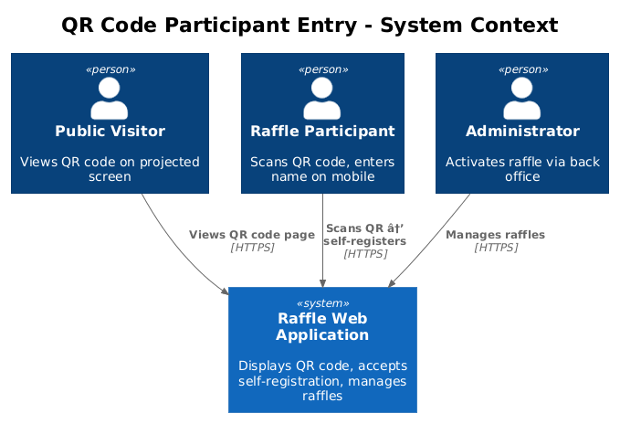
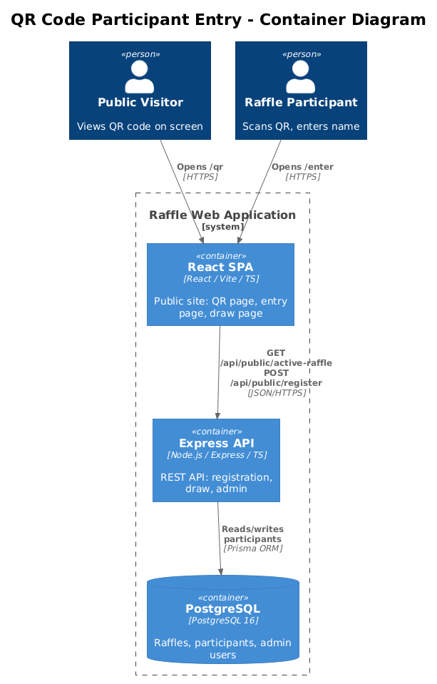
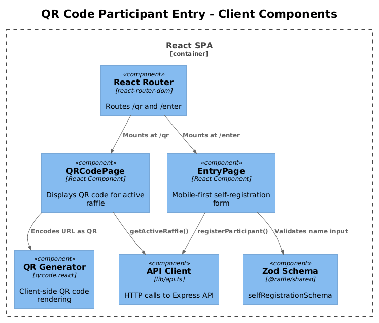
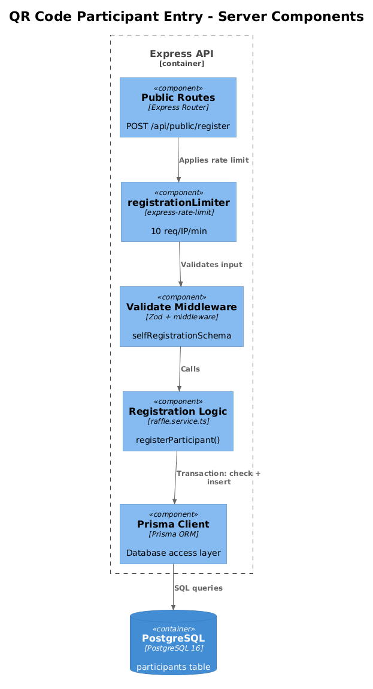
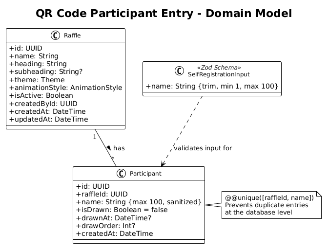
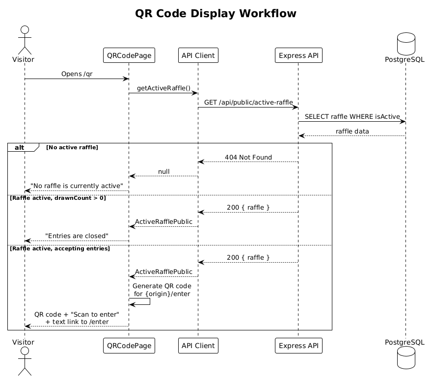
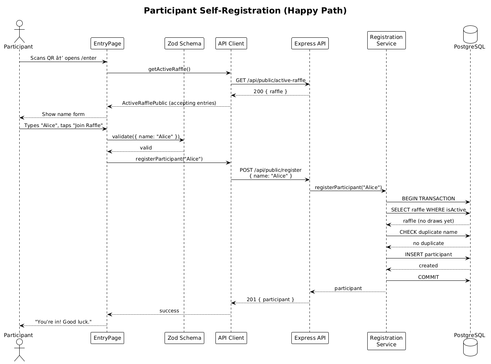
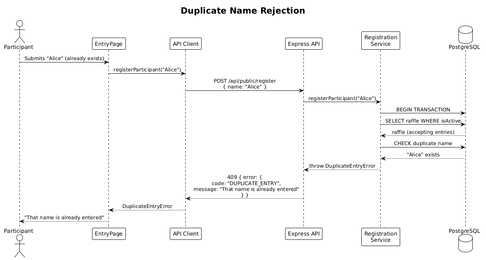

# QR Code Participant Entry — Detailed Design

## 1. Overview

This feature enables raffle participants to self-register by scanning a QR code displayed on the public site. Instead of requiring an administrator to pre-populate every name, the system displays a QR code that links to a mobile-friendly registration page where users type their name and join the active raffle.

**Traces to:** L1-012, L2-038, L2-039, L2-040, L2-041, L2-044, L2-045, L2-046

**Actors:**

| Actor | Description |
|---|---|
| Raffle Participant | Scans QR code on a projected/displayed screen, opens registration page on mobile, enters name |
| Public Visitor | Views the QR code page on a projector or large display |
| Administrator | Configures and activates the raffle; participant list grows via self-registration |

**Scope:**

- QR code display page on the public site (client-side generated QR)
- Participant self-registration page (mobile-optimized form)
- Public API endpoint for submitting a name to the active raffle
- Input validation and sanitization (client + server)
- Rate limiting on the registration endpoint
- Responsiveness (xs → xl) for both pages
- WCAG 2.2 AA accessibility for both pages

## 2. Architecture

### 2.1 C4 Context Diagram

How QR Code Participant Entry fits in the broader Raffle system landscape.



### 2.2 C4 Container Diagram

The technical containers involved in this feature.



### 2.3 C4 Component Diagram — Client

Internal client-side components that support QR display and self-registration.



### 2.4 C4 Component Diagram — Server

Internal server-side components that handle the self-registration API.



## 3. Component Details

### 3.1 QRCodePage (Client)

- **Responsibility:** Renders a full-screen QR code linking to the participant entry page for the active raffle. Shows contextual messages when no raffle is active or entries are closed.
- **Route:** `/qr`
- **Dependencies:** `getActiveRaffle()` from `lib/api.ts`, a client-side QR code library (e.g., `qrcode.react`)
- **Behavior:**
  - On mount, fetches the active raffle via `GET /api/public/active-raffle`.
  - If no active raffle → displays "No raffle is currently active."
  - If raffle has drawn names (derived from `drawnCount > 0` on `ActiveRafflePublic`) → displays "Entries are closed."
  - Otherwise → renders a QR code encoding the URL `{window.location.origin}/enter`.
  - Displays instructional text: "Scan to enter the raffle."
  - Below the QR code, displays a plain-text link to `/enter` as an accessible alternative.

### 3.2 EntryPage (Client)

- **Responsibility:** Mobile-first form where a participant submits their name to the active raffle.
- **Route:** `/enter`
- **Dependencies:** New `registerParticipant()` function in `lib/api.ts`, `selfRegistrationSchema` from `@raffle/shared`
- **Behavior:**
  - On mount, fetches active raffle status via `GET /api/public/active-raffle`.
  - If no raffle active → message "No raffle is currently active."
  - If drawing has started → message "Entries are closed."
  - Otherwise → renders a form with:
    - Visible `<label>` for the name input (associated via `for`/`id`)
    - Text input (`maxLength={100}`, `required`, `aria-describedby` for validation messages)
    - "Join Raffle" submit button (min 44×44 CSS px)
  - Client-side validation via `selfRegistrationSchema` (Zod)
  - On submit → `POST /api/public/register` with `{ name }`.
  - On `201` → replaces form with "You're in! Good luck." confirmation.
  - On `409` → shows "That name is already entered."
  - On `403` → shows "Entries are closed."
  - On `404` → shows "No raffle is currently active."
  - Validation messages use an ARIA live region (`aria-live="assertive"`).

### 3.3 selfRegistrationSchema (Shared)

- **Responsibility:** Zod schema for validating participant name input, shared between client and server.
- **Location:** `packages/shared/src/validation/index.ts`
- **Schema:**
  ```typescript
  export const selfRegistrationSchema = z.object({
    name: z.string()
      .trim()
      .min(1, 'Name is required')
      .max(100, 'Name must be 100 characters or fewer'),
  });
  ```
- **Exported type:** `SelfRegistrationInput`

### 3.4 Self-Registration Route (Server)

- **Responsibility:** Handles `POST /api/public/register` — validates, sanitizes, and adds a participant to the active raffle.
- **Location:** New route handler in `packages/server/src/routes/public.routes.ts`
- **Middleware chain:** `registrationLimiter` → `validate(selfRegistrationSchema)` → handler
- **No authentication required** (public endpoint).
- **CSRF protection:** Not required (no session cookies involved; JSON content-type requirement provides basic protection per L2-041).

### 3.5 Registration Service (Server)

- **Responsibility:** Business logic for adding a self-registered participant to the active raffle, with all entry-window and duplicate checks.
- **Location:** New function `registerParticipant(name: string)` in `packages/server/src/services/raffle.service.ts`
- **Logic (inside a Prisma `$transaction`):**
  1. Find the active raffle (with participants).
  2. If no active raffle → throw `RaffleNotFoundError`.
  3. If any participant has `isDrawn === true` → throw `EntriesClosedError`.
  4. Sanitize `name`: trim whitespace, strip HTML tags.
  5. Check for duplicate (case-insensitive) against existing participant names.
  6. If duplicate → throw `DuplicateEntryError`.
  7. Create new `Participant` record with `raffleId` and sanitized `name`.
  8. Return the created participant.

### 3.6 registrationLimiter (Server)

- **Responsibility:** Rate limits the self-registration endpoint to 10 requests per IP per minute (per L2-041).
- **Location:** `packages/server/src/middleware/security.ts`
- **Configuration:**
  ```typescript
  export const registrationLimiter = rateLimit({
    windowMs: 60 * 1000,
    max: 10,
    standardHeaders: true,
    legacyHeaders: false,
    message: {
      error: {
        code: 'RATE_LIMIT_EXCEEDED',
        message: 'Too many registration attempts, please try again later',
      },
    },
  });
  ```

## 4. Data Model

### 4.1 Class Diagram



### 4.2 Entity Descriptions

No new database tables are required. Self-registered participants are stored in the existing `participants` table with the same schema as admin-added participants.

| Entity | Attribute | Notes |
|---|---|---|
| `Participant` | `id` (UUID) | Auto-generated primary key |
| | `raffleId` (UUID) | FK → `raffles.id` |
| | `name` (String) | Trimmed, sanitized plain text; max 100 chars |
| | `isDrawn` (Boolean) | Defaults `false`; set `true` on draw |
| | `drawnAt` (DateTime?) | Null until drawn |
| | `drawOrder` (Int?) | Null until drawn |
| | `createdAt` (DateTime) | Auto-set on creation |

The existing `@@unique([raffleId, name])` constraint on the `participants` table enforces that no two participants in the same raffle can have the same name — this naturally handles duplicate-entry rejection at the database level.

## 5. Key Workflows

### 5.1 QR Code Display

The visitor navigates to `/qr` and the page determines what to show.



**Steps:**

1. Visitor opens `/qr` (e.g., projected on a screen).
2. `QRCodePage` calls `GET /api/public/active-raffle`.
3. Server returns the active raffle (including participant counts).
4. Client checks if `drawnCount > 0`:
   - If yes → shows "Entries are closed."
   - If no raffle → shows "No raffle is currently active."
   - Otherwise → generates QR code client-side encoding `{origin}/enter` and displays it with instructional text.

### 5.2 Participant Self-Registration (Happy Path)

A participant scans the QR code, lands on `/enter`, and submits their name.



**Steps:**

1. Participant scans QR code → mobile browser opens `/enter`.
2. `EntryPage` calls `GET /api/public/active-raffle` to verify the raffle is accepting entries.
3. Participant types name and taps "Join Raffle."
4. Client validates via `selfRegistrationSchema`.
5. Client sends `POST /api/public/register` with `{ name: "Alice" }`.
6. Server validates, sanitizes, checks entry window, checks duplicates (all in a transaction).
7. Server inserts a new `Participant` row.
8. Server returns `201 Created`.
9. Client shows "You're in! Good luck."

### 5.3 Duplicate Name Rejection



**Steps:**

1. Participant submits a name that already exists in the active raffle.
2. Server detects duplicate (via case-insensitive check or unique constraint violation).
3. Server returns `409 Conflict` with `{ error: { code: "DUPLICATE_ENTRY", message: "That name is already entered" } }`.
4. Client displays the error message inline.

## 6. API Contracts

### 6.1 POST /api/public/register

**Purpose:** Add a self-registered participant to the active raffle.

**Request:**

```http
POST /api/public/register
Content-Type: application/json

{
  "name": "Alice"
}
```

**Responses:**

| Status | Code | Body | Condition |
|---|---|---|---|
| `201` | — | `{ "participant": { "id": "...", "name": "Alice" } }` | Successfully registered |
| `400` | `VALIDATION_ERROR` | `{ "error": { "code": "VALIDATION_ERROR", "message": "..." } }` | Invalid input (empty, too long, whitespace-only) |
| `403` | `ENTRIES_CLOSED` | `{ "error": { "code": "ENTRIES_CLOSED", "message": "Entries are closed" } }` | Drawing has already started |
| `404` | `NOT_FOUND` | `{ "error": { "code": "NOT_FOUND", "message": "No active raffle found" } }` | No raffle is active |
| `409` | `DUPLICATE_ENTRY` | `{ "error": { "code": "DUPLICATE_ENTRY", "message": "That name is already entered" } }` | Name already exists in raffle |
| `429` | `RATE_LIMIT_EXCEEDED` | `{ "error": { "code": "RATE_LIMIT_EXCEEDED", "message": "..." } }` | More than 10 requests/min from this IP |

### 6.2 GET /api/public/active-raffle (Existing — No Changes)

The existing endpoint already returns `ActiveRafflePublic` which includes `totalCount` and `remainingCount`. The client can derive whether drawing has started by comparing `totalCount !== remainingCount` (i.e., at least one name has been drawn). No server changes required for this endpoint.

## 7. Security Considerations

| Concern | Mitigation |
|---|---|
| **XSS via participant names** | Server sanitizes all names (strip HTML tags, trim whitespace) before storage. Names are rendered as text content, never as raw HTML. (L2-040) |
| **Input injection** | Zod schema validation on both client and server. Server validation is authoritative and cannot be bypassed. (L2-040) |
| **Spam / abuse** | Rate limiting: 10 requests per IP per minute on `POST /api/public/register`. (L2-041) |
| **CSRF** | JSON `Content-Type` requirement provides baseline protection. No session cookies are used on public endpoints. (L2-041) |
| **Duplicate abuse** | Database unique constraint `@@unique([raffleId, name])` prevents duplicate entries at the DB level even under concurrency. |
| **Data integrity** | All registration logic runs inside a Prisma `$transaction` to ensure atomicity of entry-window checks + insert. |

## 8. Open Questions

1. **QR code library choice:** `qrcode.react` is the most popular React QR library (MIT license, zero dependencies). Should we consider `react-qr-code` instead? Recommendation: use `qrcode.react` for its maturity and bundle size.
2. **Name sanitization depth:** L2-040 says "strip HTML tags." Should we also strip non-printable characters, emoji, or Unicode control characters? Recommendation: strip HTML tags and non-printable control characters; allow emoji and international characters.
3. **Real-time participant count on QR page:** Should the QR page poll for updated participant counts, or is a static snapshot on page load sufficient? Recommendation: static snapshot is sufficient for MVP; real-time updates can be added later via polling or WebSockets.
