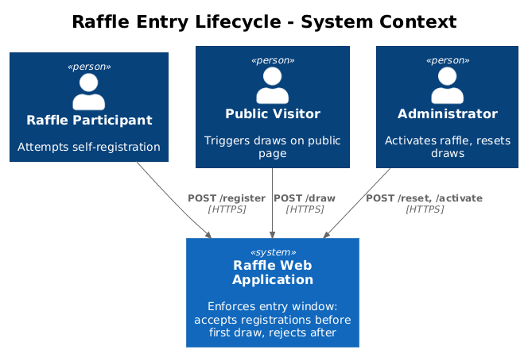
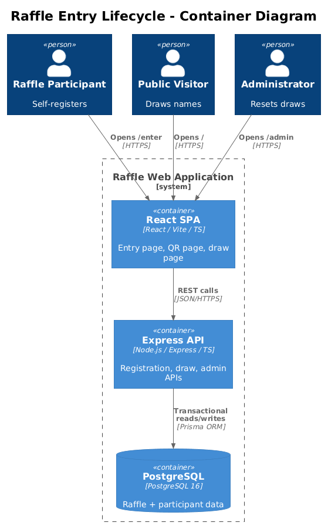
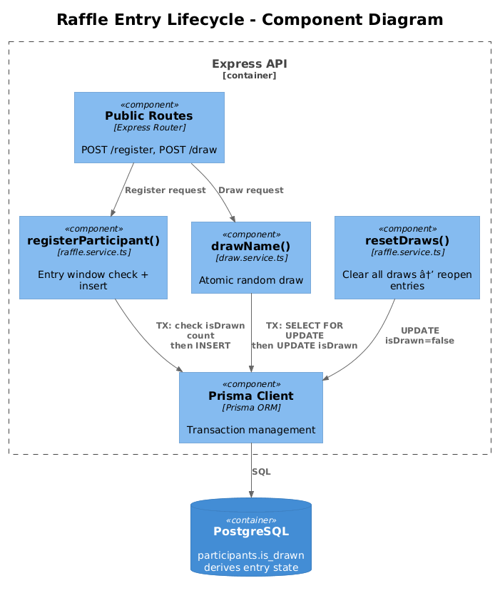
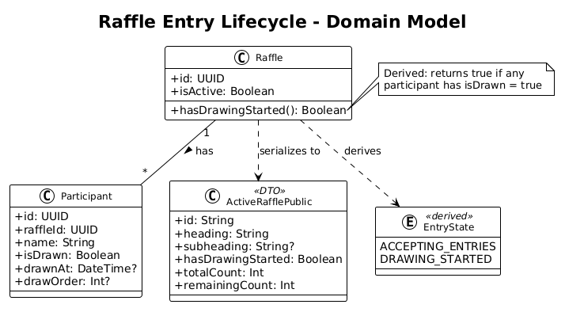
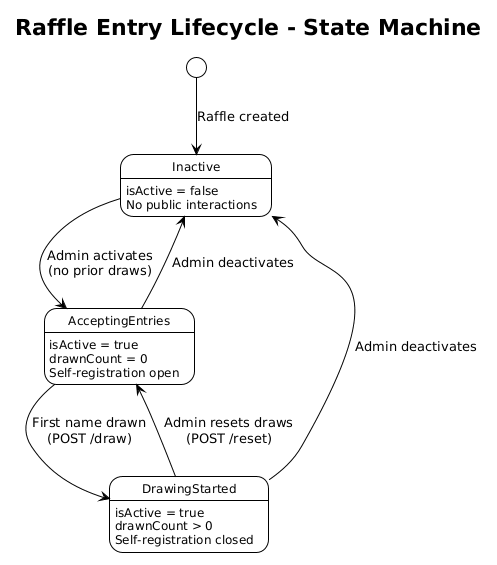
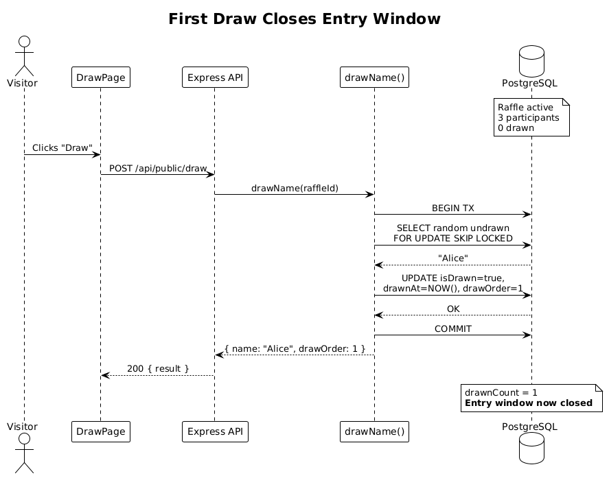
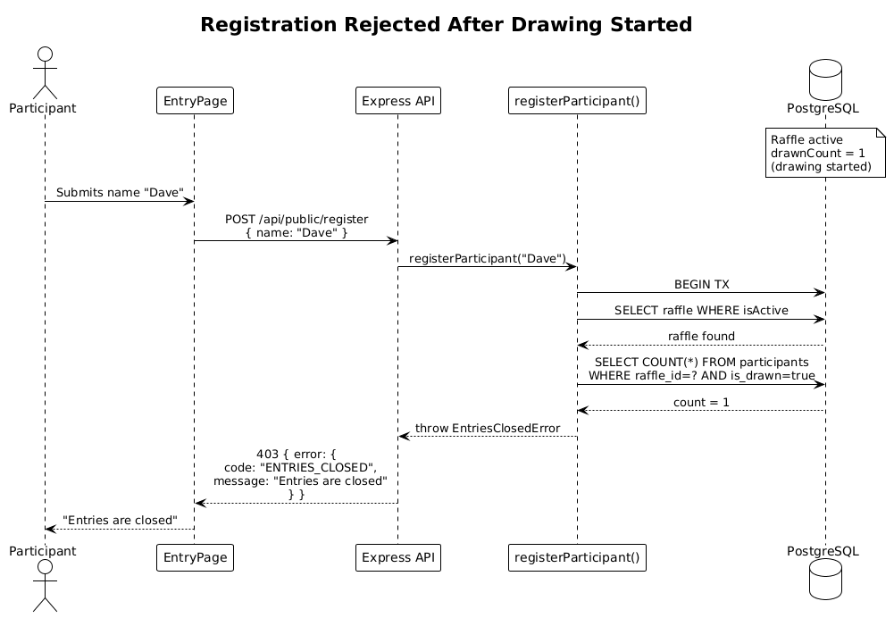
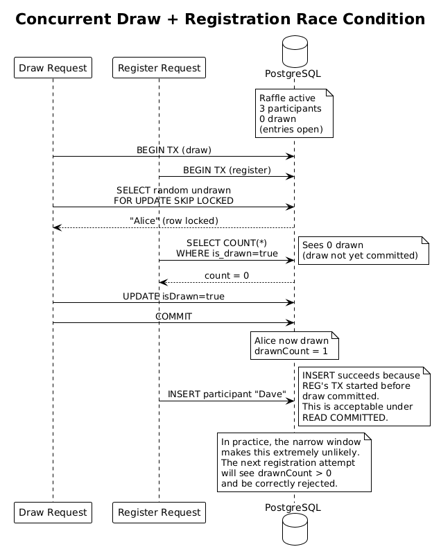
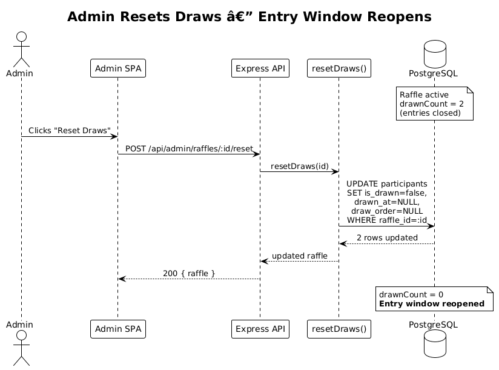

# Raffle Entry Lifecycle — Detailed Design

## 1. Overview

This feature enforces a temporal entry window for raffle participation: self-registration is permitted only while the raffle is active **and** before drawing has begun. Once the first name is drawn, the raffle transitions to a "drawing started" state and no new entries are accepted. This transition is automatic (derived from draw data), irreversible until an admin resets draws, and enforced at the server level regardless of client state.

**Traces to:** L1-013, L2-042, L2-043

**Actors:**

| Actor | Description |
|---|---|
| Raffle Participant | Attempts to self-register; may be accepted or rejected depending on the entry window |
| Public Visitor | Views the QR code page or draw page; sees entry-window status |
| Administrator | Activates raffle, triggers draws, resets draws (which reopens entry window) |

**Scope:**

- Server-side entry-window state derivation (no new DB columns)
- Server-side enforcement: reject `POST /api/public/register` after first draw
- Client-side UX: QR page and entry page reflect entry-window state
- Concurrency safety: database-level checks prevent race conditions between draw and register
- Reset behavior: admin draw reset returns raffle to "accepting entries"
- Public API state exposure: active raffle response includes `hasDrawingStarted` flag

## 2. Architecture

### 2.1 C4 Context Diagram

How the entry lifecycle constraint fits into the Raffle system.



### 2.2 C4 Container Diagram

Containers involved in enforcing the entry lifecycle.



### 2.3 C4 Component Diagram

Internal components that collaborate to enforce the entry window.



## 3. Component Details

### 3.1 Entry-Window State Derivation (Server)

- **Responsibility:** Determines whether a raffle is "accepting entries" or "drawing started" by querying existing data — no new database column is introduced.
- **Location:** `packages/server/src/services/raffle.service.ts`
- **Logic:** A raffle is in "drawing started" state if and only if `SELECT COUNT(*) FROM participants WHERE raffle_id = :id AND is_drawn = true` returns a value > 0. This is evaluated inside the same transaction as the registration check.
- **Design rationale (L2-042):** The entry state is derived from whether any draws have occurred — no separate manual toggle is required. This ensures the state cannot become inconsistent with actual draw history.

### 3.2 registerParticipant() — Entry Window Guard (Server)

- **Responsibility:** Before inserting a new participant, verifies that no draws have occurred for the active raffle. If draws exist, rejects the request.
- **Location:** `packages/server/src/services/raffle.service.ts` → `registerParticipant()`
- **Enforcement approach:**
  ```typescript
  const hasDraws = await tx.participant.count({
    where: { raffleId: raffle.id, isDrawn: true },
  });
  if (hasDraws > 0) {
    throw new EntriesClosedError();
  }
  ```
- **Transaction isolation:** This check runs inside the same `$transaction` as the insert. Prisma transactions use PostgreSQL's default `READ COMMITTED` isolation. Combined with the `FOR UPDATE SKIP LOCKED` in `drawName()`, this prevents the race condition where a draw and a registration happen simultaneously.
- **Per L2-043:** "The server shall use database-level checks (not in-memory state) to enforce this constraint, ensuring consistency across server restarts and multiple instances."

### 3.3 EntriesClosedError (Server)

- **Responsibility:** Custom error class thrown when a registration is attempted after drawing has started.
- **Location:** `packages/server/src/services/raffle.service.ts`
- **Definition:**
  ```typescript
  export class EntriesClosedError extends Error {
    constructor() {
      super('Entries are closed');
      this.name = 'EntriesClosedError';
    }
  }
  ```

### 3.4 DuplicateEntryError (Server)

- **Responsibility:** Custom error class thrown when a participant name already exists in the raffle.
- **Location:** `packages/server/src/services/raffle.service.ts`
- **Definition:**
  ```typescript
  export class DuplicateEntryError extends Error {
    constructor() {
      super('That name is already entered');
      this.name = 'DuplicateEntryError';
    }
  }
  ```

### 3.5 Public Route Handler — POST /api/public/register (Server)

- **Responsibility:** Maps service-layer errors to HTTP responses.
- **Location:** `packages/server/src/routes/public.routes.ts`
- **Error mapping:**

  | Error class | HTTP status | Error code |
  |---|---|---|
  | `EntriesClosedError` | `403` | `ENTRIES_CLOSED` |
  | `DuplicateEntryError` | `409` | `DUPLICATE_ENTRY` |
  | `RaffleNotFoundError` | `404` | `NOT_FOUND` |
  | Prisma `P2002` (unique violation) | `409` | `DUPLICATE_ENTRY` |

### 3.6 ActiveRafflePublic — hasDrawingStarted Flag (Shared)

- **Responsibility:** Expose the entry-window state to clients so they can show/hide the registration form and QR code.
- **Location:** `packages/shared/src/types/index.ts` → `ActiveRafflePublic`
- **Change:** Add a `hasDrawingStarted: boolean` field.
  - Computed server-side: `hasDrawingStarted = drawnCount > 0` (derived from existing `participants.isDrawn`).
  - Clients currently can infer this from `totalCount !== remainingCount`, but an explicit boolean is clearer and less error-prone.
- **Backward compatibility:** The field is additive; existing consumers that don't use it are unaffected.

### 3.7 getActiveRaffle() — Populate hasDrawingStarted (Server)

- **Responsibility:** Sets the `hasDrawingStarted` flag on the `ActiveRafflePublic` response.
- **Location:** `packages/server/src/services/raffle.service.ts` → `getActiveRaffle()`
- **Change:** After computing `totalCount` and `remainingCount`, add:
  ```typescript
  hasDrawingStarted: totalCount !== remainingCount,
  ```

### 3.8 QRCodePage — Entry Window Awareness (Client)

- **Responsibility:** Uses `hasDrawingStarted` to decide whether to render the QR code or an "Entries are closed" message.
- **Location:** `packages/client/src/public-app/pages/QRCodePage.tsx`
- **Logic:**
  ```typescript
  if (raffle.hasDrawingStarted) {
    return <ClosedMessage text="Entries are closed" />;
  }
  return <QRCode value={`${origin}/enter`} />;
  ```

### 3.9 EntryPage — Entry Window Awareness (Client)

- **Responsibility:** Uses `hasDrawingStarted` to decide whether to show the registration form or an "Entries are closed" message.
- **Location:** `packages/client/src/public-app/pages/EntryPage.tsx`
- **Logic:** Same pattern as QRCodePage. Also handles a `403 ENTRIES_CLOSED` response from the server if the state changes between page load and form submission.

### 3.10 resetDraws() — Reopen Entry Window (Server)

- **Responsibility:** When an admin resets draws for a raffle, the entry window automatically reopens because the derived state now shows zero drawn participants.
- **Location:** `packages/server/src/services/raffle.service.ts` → `resetDraws()`
- **No code change needed.** The existing `resetDraws()` already sets `isDrawn = false`, `drawnAt = null`, `drawOrder = null` for all participants. Since the entry-window state is derived from `isDrawn`, resetting draws inherently reopens the entry window.

## 4. Data Model

### 4.1 Class Diagram



### 4.2 Entity Descriptions

**No schema changes.** The entry lifecycle is entirely derived from existing data:

| Derived State | Condition | Meaning |
|---|---|---|
| `accepting_entries` | Active raffle + zero participants with `isDrawn = true` | New self-registrations are permitted |
| `drawing_started` | Active raffle + at least one participant with `isDrawn = true` | New self-registrations are blocked |

The `Participant.isDrawn` column and the existing `@@index([raffleId, isDrawn])` index make the state-derivation query efficient.

### 4.3 State Machine



The raffle entry lifecycle has three states:

1. **Inactive** — Raffle exists but is not active. No public interactions.
2. **Accepting Entries** — Raffle is active, no names drawn. Self-registration is open.
3. **Drawing Started** — Raffle is active, at least one name drawn. Self-registration is closed.

Transitions:
- `Inactive → Accepting Entries`: Admin activates raffle (and no draws exist).
- `Accepting Entries → Drawing Started`: First name is drawn via `POST /api/public/draw`.
- `Drawing Started → Accepting Entries`: Admin resets draws via `POST /api/admin/raffles/:id/reset`.
- `Accepting Entries → Inactive`: Admin deactivates raffle.
- `Drawing Started → Inactive`: Admin deactivates raffle.

## 5. Key Workflows

### 5.1 First Draw Closes Entry Window

When the first draw occurs, the entry window automatically closes for future registration attempts.



**Steps:**

1. Raffle is active and accepting entries (zero drawn participants).
2. Public visitor triggers `POST /api/public/draw`.
3. `drawName()` selects a random participant, sets `isDrawn = true`.
4. The raffle now has `drawnCount > 0` — entry window is implicitly closed.
5. Subsequent `POST /api/public/register` calls are rejected with `403 ENTRIES_CLOSED`.

### 5.2 Registration Rejected After Drawing

A participant attempts to register after at least one name has been drawn.



**Steps:**

1. Participant opens `/enter` and sees the form (page was loaded before the draw).
2. Meanwhile, a draw occurs on the main screen.
3. Participant submits their name.
4. Server checks `participants WHERE isDrawn = true` inside the transaction → count > 0.
5. Server throws `EntriesClosedError`.
6. Client receives `403` and shows "Entries are closed."

### 5.3 Concurrent Draw and Registration (Race Condition)

Two concurrent requests: one to draw and one to register.



**Steps:**

1. Two requests arrive nearly simultaneously: a draw and a registration.
2. The draw transaction acquires a row lock (`FOR UPDATE SKIP LOCKED`) and completes first.
3. The registration transaction begins, queries for drawn participants, finds `count > 0`.
4. Registration is rejected with `403`.
5. Per L2-043: "Given two concurrent requests — one to draw a name and one to self-register — when the draw completes first, then the self-registration request is rejected."

### 5.4 Admin Resets Draws — Entry Window Reopens

An admin resets the raffle draws, which re-opens the entry window.



**Steps:**

1. Raffle is in "drawing started" state (has drawn participants).
2. Admin calls `POST /api/admin/raffles/:id/reset`.
3. Server sets all `isDrawn = false`, `drawnAt = null`, `drawOrder = null`.
4. Raffle now has zero drawn participants → entry window is open again.
5. Subsequent registration calls succeed.

## 6. API Contracts

### 6.1 GET /api/public/active-raffle (Modified)

**Change:** Response now includes `hasDrawingStarted: boolean`.

```json
{
  "raffle": {
    "id": "abc-123",
    "heading": "Company Raffle",
    "subheading": "Win a prize!",
    "theme": "cosmic",
    "animationStyle": "slot_machine",
    "participantNames": ["Alice", "Bob", "Charlie"],
    "allDrawn": false,
    "lastDrawnName": null,
    "totalCount": 3,
    "remainingCount": 3,
    "hasDrawingStarted": false
  }
}
```

After one draw:
```json
{
  "raffle": {
    "...": "...",
    "totalCount": 3,
    "remainingCount": 2,
    "hasDrawingStarted": true
  }
}
```

### 6.2 POST /api/public/register — 403 Response

When drawing has started:

```json
{
  "error": {
    "code": "ENTRIES_CLOSED",
    "message": "Entries are closed"
  }
}
```

## 7. Security Considerations

| Concern | Mitigation |
|---|---|
| **Race condition between draw and register** | Both operations use Prisma `$transaction`. The draw uses `FOR UPDATE SKIP LOCKED` for row locking. The registration check queries `isDrawn` count inside its own transaction. PostgreSQL's `READ COMMITTED` isolation ensures the registration sees committed draw results. |
| **Client-side bypass** | Entry-window enforcement is server-side only. Client-side state is advisory (for UX). Even if a client ignores the `hasDrawingStarted` flag, the server will reject the registration. (L2-043) |
| **In-memory state consistency** | No in-memory caches are used. All state is derived from the database, ensuring consistency across server restarts and horizontally-scaled instances. (L2-043) |
| **Admin reset does not corrupt data** | `resetDraws()` runs in a transaction. After reset, the entry window naturally reopens because zero participants have `isDrawn = true`. |

## 8. Open Questions

1. **Should the entry page poll for state changes?** If a participant loads `/enter` while entries are open, but a draw happens before they submit, they get a 403. Should the page poll periodically (e.g., every 10s) to proactively show "Entries are closed"? Recommendation: yes, a lightweight poll of `GET /api/public/active-raffle` every 10 seconds would improve UX, but it's not required for correctness.
2. **Should `hasDrawingStarted` be a computed field or stored?** Current design derives it at query time. This is correct and simple, but if the `participants` table grows very large, the count query could become slow. The existing `@@index([raffleId, isDrawn])` mitigates this. Recommendation: keep it derived; add caching only if profiling reveals a bottleneck.
